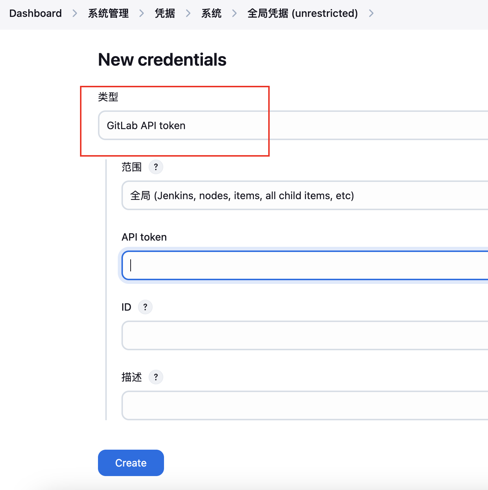
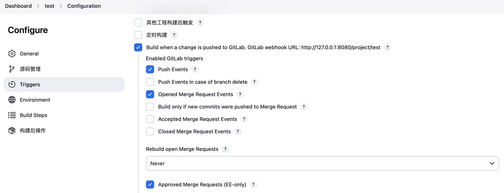
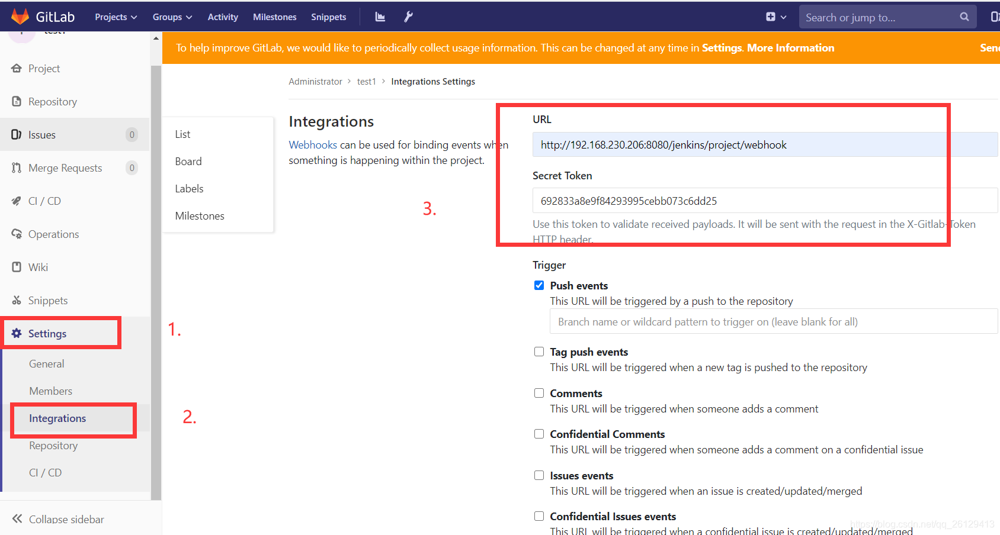
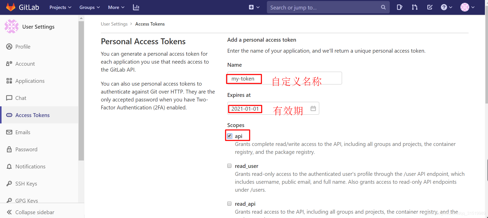

# Jenkins & GitLab configure webhook

GitLab version: community edition 10.4.2

Jenkins version: 2.426.3

## Install GitLab plugins

旧版本需要插件gitlab和gitlab-hook，但是gitlab-hook插件由于安全问题已经废弃。

具体见 https://www.jenkins.io/blog/2021/12/22/deprecated-ruby-runtime/

所以只需要下载Gitlab插件及其相关依赖插件即可。

Gitlab Plugin 这个插件允许GitLab在提交代码或打开/更新合并请求时触发Jenkins中的构建。它还可以将构建状态发送回GitLab。

## Configure

### Jenkins

> 各版本界面可能不同

- 创建GitLab凭证
- 配置Git拉取代码用到的密钥凭证
- 生成Jenkins Token

此处APIToken在GitLab生成，仅生成时可看到，务必保管好。

构建触发器选择 “Build when a change is pushed to GitLab” （记住后面的GitLab webhook URL 后面要填在gitlab的webhooks中），按照下面勾选

点 “Generate” 生成 token，这个 token 用于填写到 gitlab 的 webhook 里，gitlab 检测到代码提交，会通知 webhook 里填写的 Jenkins 生成的回调URL。

注: 复制出 URL 和 token，后面配置 gitlab 的 webhook 会用到

### GitLab

根据版本不同，webhook功能在不同位置。 

当前使用这个版本在项目侧边栏：`Settings -> Integrations`中。

填写 URL和 Secret Token即可，保存后测试是否可以触发。

> Secret Token 来自Jenkins中。
> 
> 测试默认触发master分支，实际根据自己推送的分支进行触发。

